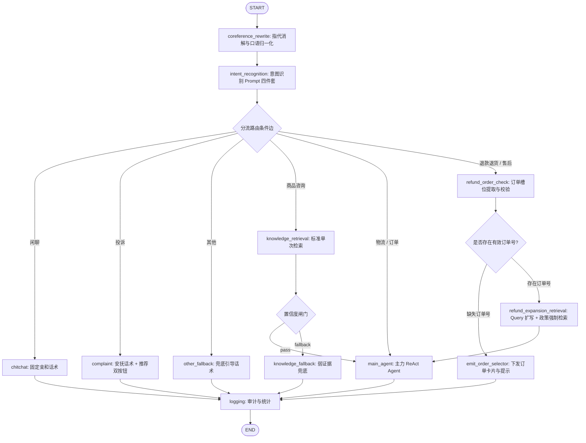

# 客服工作流核心分流器正式版设计规范 (Router Refinement Spec)

## 1. 背景与目标

在第五章（Ch05）中，我们搭建了基于 LangGraph 的确定性工作流骨架，但其中的前置节点（指代消解为简单透传，意图识别为基础 7 分类且缺乏置信度与兜底）以及退款/售后分流规则均为占位/最简实现。
本章（Ch06）将分流器（Router）及其上下游链路正式升级为生产级方案，重点解决：
1. **多轮对话指代消解与口语归一化**：通过大模型结合对话历史补全省略语境，已完整句子原样透传不强行改写；
2. **检索侧 Query 扩写**：仅针对退款退货/售后等核心高频、低容错场景进行检索词泛化，多路召回并去重合并；
3. **意图识别 Prompt 四件套**：8 分类枚举选择题（7 类业务 + 1 类「其他」兜底）、强 JSON 输出（含 `confidence`）、边界 few-shot 样例、大模型保障基线并在成本吃紧时支持小模型置信度级联降级；
4. **确定性退款/售后子流程**：先提取订单数据 -> 槽位缺失时下发订单选择器并挂起中断 -> 槽位就绪后触发 Query 扩写并强制检索政策条款 -> 主力 Agent 仅专注判定「能否退款」；
5. **槽位处理与前端交互闭环**：不让模型瞎猜订单号，聊天流展示可点选订单卡片回填；退款原因不追问，提交退款单时从固定类目下拉选择。

---

## 2. 架构全景与图拓扑设计

### 2.1 工作流图拓扑更新



---

## 3. 核心节点详细设计

### 3.1 指代消解与口语归一化节点 (`coreference_rewrite_node`)
- **定位**：位于工作流起始位置，接收用户原始 `input_query` 及当前会话最近历史消息。
- **核心原则**：
  1. **指代消解**：将代词（「它」、「这个」、「那件」、「单子」）或省略主语的提问（「能退吗」、「到哪了」），结合历史上下文补全为自包含问题（如「订单1001极简保暖羽绒服能退吗」）；
  2. **口语归一化**：将口语模糊问法（如「货走哪了老铁」、「退了算求」、「这玩意能不能保修」）规范化为清晰的标准业务问法；
  3. **原样透传保护（Hard Gate）**：若用户输入本身结构完整、无指代模糊（如「查询订单1001」或「什么是七天无理由退货」），或者仅为寒暄（「你好」），**强制原样返回**，严禁过度改写或扭曲事实。
- **输入输出**：
  - 输入：`state.input_query`，`state.messages`（最近 4~6 轮会话历史）；
  - 输出：`{"resolved_query": "标准独立提问文本"}`。

### 3.2 意图识别 Prompt 四件套与级联路由 (`intent_recognition_node`)
- **Prompt 四件套要素**：
  1. **枚举选择题**：严格限定 8 大类别：
     - `物流`：询问运单、包裹轨迹、发货时效等
     - `订单`：查询订单状态、支付金额、下单明细等
     - `商品咨询`：咨询商品价格、规格属性、库存尺码等（简单知识类）
     - `退款退货`：退货流程、退款到账、退货运费、是否能退
     - `售后`：保修、维修、质量破损、错发漏发换货
     - `投诉`：强烈表达对服务不满、要求人工介入纠纷、抗议
     - `闲聊`：打招呼、寒暄、感谢、非业务问候
     - `其他`：非电商业务问题（如讲故事、算数学、天气）、无意义输入或拿不准的怪问题
  2. **强制标准 JSON**：
     ```json
     {"intent": "类别名称", "confidence": 0.95}
     ```
  3. **边界 Few-shot 样例**：
     - 包含退款 vs 售后的语义边界；
     - 包含催发货（物流） vs 催促退款（退款退货）的边界；
     - 包含超出客服领域的非业务问题落入「其他」的样例。
  4. **「其他」兜底保护**：
     - 模型拿不准或超出范围时，严禁硬塞进业务意图，一律判定为「其他」。
- **模型级联路由策略**：
  - 默认使用高精度主力模型保障首选识别率；
  - 双层降级开关：可配置先由小模型判定，若 `confidence < 0.85` 或判定为「其他」，自动级联大模型进行二次裁决。
- **输出**：`{"intent": "...", "confidence": 0.xx, "intent_reason": "..."}`。

### 3.3 检索侧 Query 扩写与多路召回合并 (`refund_expansion_retrieval_node`)
- **触发范围**：
  **仅对「退款退货」与「售后」核心确定性子流程触发**；商品咨询与常规 FAQ 坚持单 Query 检索，避免无谓开销。
- **扩写策略**：
  基于 `resolved_query` 与提取到的商品/订单上下文，生成 2~3 个侧重点互补的检索 Query（针对通用政策、特定品类限制、运费与寄回规范）。
- **强制输出格式**：
  ```json
  {"queries": ["检索词1", "检索词2", "检索词3"]}
  ```
- **多路召回与去重**：
  - 并发检索：通过 `asyncio.gather` 并发调用检索器；
  - 去重与合并：按文档文本内容哈希去重，重复命中时保留最高得分；
  - 排序与截断：按 score 倒序排列，截取 Top-K（3~5 篇）注入 `state.retrieved_docs`。

### 3.4 退款/售后确定性子流程与槽位处理 (`refund_order_check_node`)
- **槽位识别**：
  通过正则提取（`TB\d+`、`\b100\d\b` 等）与语义分析提取目标订单号。
- **缺单拦截与挂起**：
  - 若未检测到有效订单号：
    - `state.status = "need_order_selection"`
    - `state.response_text = "为您查询退款政策前，请先选择您需要咨询的订单："`
    - `state.suggested_orders = [...]`（装配当前用户的候选订单简要卡片数据）
    - 状态机条件边识别到 `need_order_selection`，直接跳过检索与 Agent，转入 `logging -> END`；
    - 在 SSE 流中下发 `order_selector` 事件。
- **命中订单号**：
  - 调用订单工具预取真实订单详情（订单状态、金额、下单时间、商品明细）；
  - 将结构化订单详情注入 `state.order_data`；
  - 流程顺利推进至 `refund_expansion_retrieval`。

### 3.5 主力 Agent 裁决收敛 (`main_agent`)
- **退款子流程下的专职化 Prompt**：
  在退款子流程中，Agent System 上下文已完整预装：
  - `【订单真实状态】`：订单编号、当前状态（如已发货/已签收）、商品明细、下单时间；
  - `【官方政策条款】`：多路扩写召回的高置信度退换货与售后条款；
- **Agent 裁决规则**：
  - Agent 不再重复调用查单工具，也不在对话中长篇追问退款原因；
  - 核心职责：对照订单状态与政策条款，判断「该订单是否支持退款/退货」，给出客观明确的判定理由与时效运费说明；
  - 若满足退款条件，附带 `suggested_actions: ["apply_refund"]`。

---

## 4. 状态机与协议扩展

### 4.1 `AgentWorkflowState` 扩展字段
```python
class AgentWorkflowState(TypedDict):
    conversation_id: int
    user_id: str
    input_query: str
    resolved_query: str
    intent: Optional[str]
    confidence: Optional[float]
    intent_reason: Optional[str]
    order_id: Optional[str]
    order_data: Optional[Dict[str, Any]]
    suggested_orders: Optional[List[Dict[str, Any]]]
    retrieved_docs: List[Dict[str, Any]]
    confidence_passed: Optional[bool]
    messages: Annotated[List[BaseMessage], add_messages]
    response_text: str
    suggested_actions: List[str]
    token_usage: Dict[str, int]
    steps_taken: int
    status: str
```

### 4.2 SSE 协议扩展
- **订单选择器事件 (`order_selector`)**：
  ```json
  {
    "event_type": "order_selector",
    "conversation_id": 101,
    "orders": [
      {
        "order_id": "1001",
        "product_name": "极简保暖羽绒服",
        "amount": "299.00元",
        "status": "已发货",
        "create_time": "2026-09-05 14:20:00"
      },
      {
        "order_id": "1002",
        "product_name": "潮流纯棉连帽卫衣",
        "amount": "159.00元",
        "status": "待支付",
        "create_time": "2026-09-06 10:15:00"
      },
      {
        "order_id": "1003",
        "product_name": "经典修身牛仔裤",
        "amount": "89.00元",
        "status": "已完成",
        "create_time": "2026-09-01 09:30:00"
      }
    ]
  }
  ```
- **动作推荐事件 (`actions`)**：
  支持 `["apply_refund", "transfer_agent", "create_ticket"]`。

---

## 5. 前端交互配套规范

### 5.1 聊天流可点选订单卡片
- 前端收到 `order_selector` 事件后，在消息流中渲染订单卡片列表；
- 每张卡片包含：订单编号、商品名称、金额、状态标签；
- 用户点击卡片后：
  1. 卡片置灰禁用，显示已选状态；
  2. 前端自动向对话框发送 `退款订单: {order_id}`（如 `退款订单: 1001`）；
  3. 触发工作流下一轮，消解与槽位提取直接捕获订单 1001，顺利走通后续政策判定。

### 5.2 退款单极简弹窗表单 (`apply_refund`)
- 触发：点击助手气泡下的「📝 申请退款」按钮；
- 弹窗展示：
  - 订单号（只读回显，如 `1001`）；
  - 退款原因（下拉选择框，固定类目）：
    1. 7天无理由退货
    2. 商品质量问题/破损
    3. 少件/漏发/错发
    4. 尺码/规格不合
    5. 物流停滞想退款
- 提交动作：
  调用 `POST /api/tickets`，传入 `conversation_id`, `ticket_type="退款退货"`, `description="退款原因: ... (订单: 1001)"`；
- 成功后在聊天流追加系统反馈：「您的退款申请已提交，工单号: {ticket_no}，专员将在 24 小时内为您审核」。

---

## 6. 测试与质量评估矩阵

1. **预处理评估套件与单测**：
   - `tests/test_workflow_coref_rewrite.py`：消解前/消解后对比、完整提问原样透传率（100% 保护）；
   - `tests/test_workflow_intent_four_elements.py`：意图识别 Prompt 四件套测试、8 分类 JSON 解析稳定性、怪问题落入「其他」率、置信度低级联降级；
2. **扩写与子流程单测**：
   - `tests/test_workflow_query_expansion.py`：扩写 JSON 格式校验、仅退款/售后场景触发、多路检索去重与排序截断；
   - `tests/test_workflow_refund_subflow.py`：缺订单号挂起下发 `order_selector`、有订单号预取数据并直通 Agent 裁决；
3. **端到端多轮验收套件 (`tests/test_ch06_acceptance.py`)**：
   - 验证多轮对话状态机：物流 -> 退款（缺单点选） -> 政策裁决 -> 物流追问，每一轮意图判对、指代补全对；
   - 浏览器端真实交互验证（订单卡片点选、退款表单提交）。
